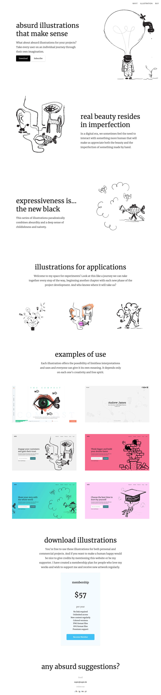

# Aufgabenstellung

Als freiberuflicher Illustrator auf zu treten, kann eine beängstigende Karriere sein, aber mit der richtigen Begeisterung, der Bereitschaft zu langen Arbeitsstunden und ein paar Kontakten sind Sie auf diesen Moment vorbereitet.

Auch eine gute Website wird viel helfen.

Deine Aufgabe heute ist es, diesem Illustrator zu helfen. Du wirst ihm eine Website erstellen.

Danke!!!

## Inhalt

### nav

- why?
- illustration
- buy

### absurd illustrations that make sense

What about absurd illustrations for your projects? Take every user on an individual journey through their own imagination.

### real beauty resides in imperfection

In a digital era, we sometimes feel the need to interact with something more human that will make us appreciate both the beauty and the imperfection of something made by hand.

### expressiveness is... the new black

This series of illustrations paradoxically combines absurdity and a deep sense of childishness and naivety. illustrations for applications Welcome to my space for experiments! Look at this like a journey we can take together every step of the way, beginning another chapter with each new phase of the project development. And who knows where it will take us?

### examples of use

Each illustration offers the possibility of limitless interpretations and uses and everyone can give it its own meaning. It depends only on each one's creativity and free spirit.

### download illustrations

You're free to use these illustrations for both personal and commercial projects. And if you want to make a human happy would be nice to give credits by mentioning this website or be my supporter. I have created a membership plan for people who love my works and wish to support me and receive new artwork regularly.

### membership

$57 per year

- No link required
- Unlimited access
- New content regularly
- Colored versions
- PNG format files
- SVG format files
- Premium support
- __Become Member__

### any absurd suggestions

Email

super@super.de

Follow me

fb/ig/tw/yt

## Assets

__Font:__ Merriweather, Lato

__Farbe:__ #202020, #24bff2, #fff, #F5FBFE.

__Farbe social media:__ #3b5998, #fcaf45, #55acee, #c4302b

## Ergebnisvorschau

